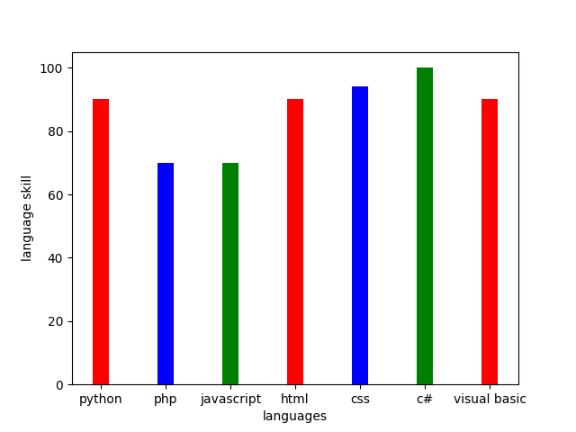

# welcome to my github portofolio
Austin Heisley-Cook
818.426.1200 | aheisleycook@gmail.com | Sherman Oaks, CA
https://github.com/aheisleycook

## Education
- Azure Programming Certification
- Santa Monica College, Santa Monica, CA
- .Net Programming Certification 
- Los Angeles Valley College, North Hollywood, CA
- Academic Recognition: Dean's List, Spring 2019
- Information Technology and Management Certification
- Taft Community College, Bakersfield, CA 
- High School Diploma
- Professional Experience
## work
- Office Support Intern (Sep 2017 – Aug 2018)
- Councilman Blumenfield’s Office, Van Nuys, CA
- Provided office support and rolled calls for Los Angeles City Council District 3 (population 260,000)
- Verified reports of illegal signage using Google Maps and Excel to encourage safe streets
- Scouted ADA-compliant venues for events to support an inclusive administration

- Student Support Services Technician / Lab Tech Assistant (Aug 2013 – June 2016)
- Taft Community College, Bakersfield, CA
- Provided tech support for a college campus of 5,200 students
- Conducted computer maintenance for all classrooms, staff, and computer facilities -Converted 1,000+ textbooks to alternative media using OCR (optical character recognition) to support students with disabilities

Additional Experience
Project Manager/Community Manager, Dragon Programming Language (Mar 2020 – Nov 2020)
Manage ongoing internal operations, overhaul documentation systems & support basic development processes. Spearheaded the transition to GitHub, oversaw website & logo redesign, and restructured the team. Coded text-to-speech library. Responsible for managing an international team.

Group Admin and Moderator, Facebook and Discord (2011 – Nov 2020)
Groups focus on computers, programming, and autism support. Total enrollment includes over 1,000,000 people.
Certificates and Areas of Expertise
Programming: Python, C#. HTML, CSS, Javascript, Visual Basic, & C++. 
Certifications: .Net, PHP, Laravel, Azure
Developer Tools: GitHub, VS Code, Visual Studio, VIM, Emacs, Geany, Sublime Text 3, PHPStorm, Kite, Web Storm, Pycharm, Datagrip, Rubymine, Rider, MS Office & LibreOffice.
["my tech and science commiiy"](http://www.forest-flower.com/)

## languages

- html
- python
- php 
- javascript
- csharp

